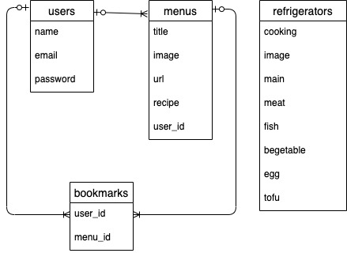

## 🍙アプリケーション名
condate bear

## 🍙アプリケーション概要
- 冷蔵庫の中身を選ぶとその材料を使ってできる献立を考えてくれます
- 今日のご飯を決めると献立ベアが褒めてくれます
- 作った献立を記録しておくことができます
- 他の人が作った献立を見ることができます
- 仕事帰りに献立を考えられるようにレスポンシブデザインに対応しています

## 🍙アプリケーションURL
https://condate-bear.ml
 
※採用担当者の方はヘッダー内の「ゲストログイン」よりログインが可能です。

## 🍙目指した課題解決

 
仕事終わりに、「ごはん作らなきゃいけないけど献立考えるのめんどくさいなあ…誰か代わりに考えてくれないかなあ…」と日々忙殺されている現代人を献立ベアがお助けします！

## 🍙特徴的な機能
冷蔵庫の中身を選ぶとその中の材料を使ってできる献立を考えてくれます。

 
 
献立を決めると献立ベアが褒めてくれます。

## 🍙要件定義
優先順位 | 機能 | 目的
-- | -- | --
高 | 冷蔵庫の中身から献立を決定する機能 | ユーザーの代わりに献立を考えるため
高 | 作ったメニューを記録しておく機能 | 作ったメニューを記録しておくため
高 | 記録したメニューを編集する機能 | 記録情報を編集するため
高 | 記録したメニューを削除する機能 | 誤った記録を削除するため
高 | 記録したメニューの詳細を見る機能 | 作ったメニューの詳細を見るため
高 | ユーザー新規登録機能 | アプリケーションを使用するため
高 | ログイン/ログアウト機能 | アプリケーションを使用するため
高 | ユーザー編集機能 | 登録したユーザー情報を編集するため
高 | マイページ機能 | 自分の記録したメニューやブックマークを確認するため
高 | ブックマーク機能 | 他のユーザーのメニューを参考にするため
高 | ブックマーク一覧機能 | 自分のブックマークを確認するため
高 | 管理者権限機能 | 冷蔵庫の中身からできる献立を登録するため
中 | カテゴリー機能 | 自分がよく作るカテゴリーを確認するため
中 | ブックマークランキング機能 | よく作られているメニューを確認するため
中 | カレンダー機能 | いつ自炊をしたのか確認するため
低 | SNS認証機能 | 新規ユーザー登録・ログインを簡単にするため
低 | パンくず機能 | サイト内のユーザーの位置をわかりやすくするため

## 🍙実装予定の機能
- カレンダー機能 
　メニューを記録した日はカレンダーに印がつく
- カテゴリー機能 
　自分がよく作るカテゴリーを確認できる
- ブックマークランキング機能 
　他のユーザーが作ろうとしているメニューを参考にすることができる 
etc...

## 🍙データベース設計

